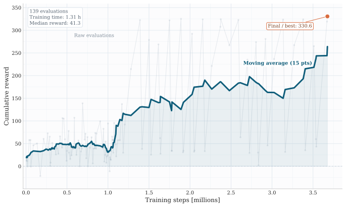
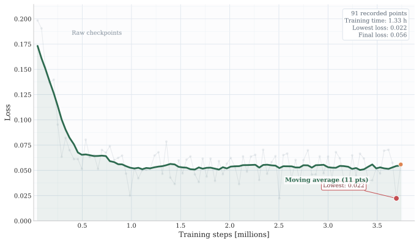

# RaceRL: A Unity ML-Agents Framework for Multi-Agent Autonomous Racing

> **Paper:** *RaceRL: A Unity ML-Agents Framework for Multi-Agent Autonomous Racing*
> Konrad Małek, Mateusz Kotarba, Tomasz Hachaj — AGH University of Krakow, Faculty of EE, Automatics, CS and Biomedical Engineering

---

## Overview

RaceRL is a lightweight, reproducible simulation framework for studying multi-agent competitive driving with reinforcement learning. It combines a custom force-based vehicle model with checkpoint-based track progression, multi-agent spawning, and a reward function explicitly designed for competitive racing.

The primary research contribution is a **transfer learning study**: a policy pretrained on a simplified physics model is fine-tuned on a more realistic target environment, reaching a **96% finish rate** and **0.3 collisions/episode** — compared to only 8% finish rate when training from scratch under the same interaction budget.

| Policy | Finish rate | Mean final rank | Collisions / ep | Avg episode time |
|---|---|---|---|---|
| Pretrained (old physics) | 30% | 4.1 / 6 | 4.5 | 43.22 s |
| From scratch (new physics) | 8% | — | 5.1 | 59.30 s |
| **Fine-tuned transferred (new physics)** | **96%** | **2.4 / 6** | **0.3** | **37.65 s** |

---

## Features

### Custom Force-Based Vehicle Model

Standard Unity WheelColliders proved unstable for multi-agent RL training. The vehicle is modeled as a rigid body with wheel forces applied at contact points:

- **Suspension** — sphere-cast per wheel, spring-damper force clamped to `[0, 15mg]`
- **Lateral tire grip** — slip-dependent grip curve (approximation of Pacejka), prevents excessive sliding
- **Ackermann-like steering** — inner wheel angle increased by 10% for realistic cornering
- **Rear-wheel drive** — engine torque curve shapes available traction as a function of speed ratio
- **Aerodynamic downforce** — proportional to speed, increases high-speed stability
- **Anti-roll bars** — load transfer between left/right wheels on each axle reduces body roll
- **Steer helper (yaw stabilization)** — auxiliary yaw torque injected when steering, reduces drifting and improves learning stability

### Environment

<table>
<tr>
<td></td>
<td></td>
</tr>
<tr>
<td colspan="2" align="center"><em>Example curriculum tracks — from simple loops to complex mixed layouts</em></td>
</tr>
</table>

<table>
<tr>
<td></td>
<td></td>
</tr>
<tr>
<td align="center"><em>Checkpoint system</em></td>
<td align="center"><em>Track boundary walls</em></td>
</tr>
</table>

- Closed tracks with ordered checkpoint triggers for dense progress measurement
- 5-level **curriculum learning**: straight line → easy left loop → easy right loop → mixed medium → mixed hard
- Track switching handled at runtime via ML-Agents environment parameters — no recompilation needed
- Custom track generation from user-defined splines

### Multi-Agent Setup

<table>
<tr>
<td></td>
<td></td>
</tr>
<tr>
<td colspan="2" align="center"><em>Multi-agent racing situations during validation</em></td>
</tr>
</table>

- Up to N agents spawned from predefined spawn transforms per episode reset
- Each agent independently registered in the checkpoint and ranking system
- Optional collision masking between agents during early training stages (grace period after spawn)
- Safety termination: wall collision, airborne/flipped for >0.75 s, speed >500 m/s, or falling below map

### RL Agent


*Agent with 7 evenly-distributed raycasts detecting walls, other agents, and checkpoints*

**Observation space (compact vector):**
- 7 raycasts — detect walls, competing vehicles, checkpoint triggers
- Track alignment — dot product between agent forward and next checkpoint forward
- Forward speed — normalized to [-1, 1]
- Lateral speed — proxy for sideways slip

**Action space (continuous):**
- `u_th ∈ [-1, 1]` — throttle / brake
- `u_steer ∈ [-1, 1]` — steering

**Reward shaping:**

| Component | Value |
|---|---|
| Correct checkpoint | +0.5 |
| Wrong checkpoint | -0.3 |
| Lap completion | +5.0 |
| Race finish | +2.0 |
| Overtake (rank improvement) | +2.0 |
| Lose position | -0.5 |
| Wall collision (episode end) | -0.5 |
| Agent collision (enter) | -0.5 |
| Agent collision (stay) | -0.02 / step |
| Dense forward speed reward | proportional to velocity |
| Dense rank pressure bonus | `1/rank × scale` per step |

---

## Training Results

<table>
<tr>
<td></td>
<td></td>
</tr>
<tr>
<td align="center"><em>Cumulative validation reward during fine-tuning (best: 330.6)</em></td>
<td align="center"><em>Training loss — rapid decrease, then stabilization</em></td>
</tr>
</table>

Fine-tuning was performed over ~3.5M steps with curriculum-based track progression. The moving average shows a consistent upward trend despite high variance in raw evaluation values, confirming stable adaptation from the pretrained initialization.

---

## Repository Structure

```
race-rl/
├── Assets/                  # Unity project assets
│   ├── Scripts/
│   │   ├── RacistAgent.cs       # ML-Agents agent — observations, actions, rewards
│   │   ├── SimpleCar.cs         # Vehicle controller (powertrain, braking, downforce)
│   │   ├── SimpleWheel.cs       # Per-wheel suspension, lateral grip
│   │   ├── TrackCheckpoints.cs  # Checkpoint system and lap/rank tracking
│   │   ├── LevelManager.cs      # Curriculum track switching
│   │   └── MultiAgentSpawner.cs # Multi-agent instantiation and lifecycle
│   └── ...
├── Config/
│   └── race-ppo.yaml        # PPO training configuration + curriculum definition
└── results/                 # Training run outputs
```

---

## Setup and Training

### Requirements

- Unity 6.0 (6000.0.59f2) LTS or Unity 2022.3+
- Python 3.10+
- CUDA-capable GPU recommended

### Install Python dependencies

```bash
pip install -r requirements.txt
```

This installs ML-Agents 1.1.0, PyTorch 2.8.0, TensorBoard, and all required packages.

### Run training

1. Open the Unity project from the `race-rl/` directory in Unity Editor.
2. Load the main race scene.
3. Start training from the repo root:

```bash
mlagents-learn race-rl/Config/race-ppo.yaml --run-id=my_run
```

4. Press **Play** in Unity Editor when prompted.

### Fine-tune from a pretrained model

```bash
mlagents-learn race-rl/Config/race-ppo.yaml \
  --run-id=finetuned_run \
  --initialize-from=<pretrained_run_id>
```

### Monitor training

```bash
tensorboard --logdir results/
```

---

## PPO Hyperparameters

| Parameter | Value |
|---|---|
| Batch size | 1024 |
| Buffer size | 40 960 |
| Learning rate | 3 × 10⁻⁴ |
| Entropy coefficient β | 5 × 10⁻³ |
| Clipping ε | 0.2 |
| Discount γ | 0.99 |
| GAE λ | 0.95 |
| Hidden units | 128 × 2 layers |
| Time horizon | 64 |
| Max steps | 21 000 000 |
| Observation normalization | enabled |

---

## Citation

If you use this framework, please cite the accompanying paper:

```
Małek, K., Kotarba, M., & Hachaj, T. (2026).
RaceRL: A Unity ML-Agents Framework for Multi-Agent Autonomous Racing.
Complex Collective Systems.
AGH University of Krakow.
```

---

## Authors

- **Konrad Małek** — kmalek@student.agh.edu.pl
- **Mateusz Kotarba** — mkotarba@student.agh.edu.pl
- **Tomasz Hachaj** — thachaj@agh.edu.pl

AGH University of Krakow, Faculty of Electrical Engineering, Automatics, Computer Science and Biomedical Engineering
